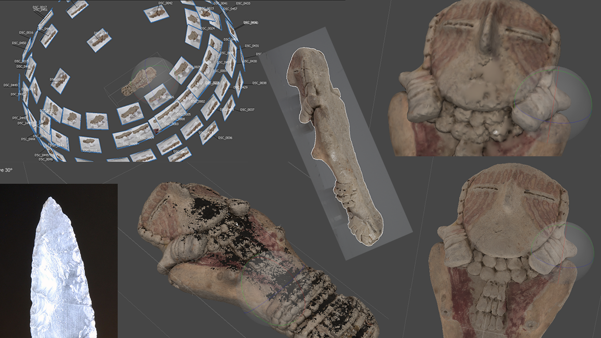

<section class="hero-panel">

 COMPUTATIONAL ARCHAEOLOGY · ASU

<h1>Reading the past through connections.</h1>

I use network science, spatial analysis, 3D methods, and computational tools to investigate people, objects, and landscapes across the ancient Southwest.

<a class="btn btn-primary" href="about.html">About me →</a><a class="btn btn-ghost" href="#research">Explore the work</a>

  

MATERIAL → SOCIAL NETWORKS

</section>

<section class="signal-row" aria-label="Research profile">
<strong>01</strong>Southwest archaeology

<strong>02</strong>Network analysis

<strong>03</strong>Digital methods

<strong>04</strong>Open research
</section>

<section id="research" class="section-block">

/ RESEARCH TOOLKIT
<h2>Computational approaches to the past.</h2>

<article class="method-card">01<h3>Networks</h3>
Material culture, social interaction, multilayer networks, and agent-based models.
○—○—○</article><article class="method-card">02<h3>Shape &amp; space</h3>
Geometric morphometrics, GIS, spatial analysis, and machine learning.
△ ◇ △</article><article class="method-card">03<h3>Digital heritage</h3>
3D modeling, photogrammetry, data integration, and reproducible tools.
▱ ◌ ▱</article>
</section>

<section class="section-block projects-section">

/ SELECTED PROJECTS
<h2>From artifacts to infrastructure.</h2>
<a class="text-link" href="about.html">More about my work →</a>

<a class="project-card project-card-wide" href="posts/Artifacts-and-Social-Networks-Submitted-Paper/post.html">
RESEARCH UPDATE<h3>Can artifacts reveal social networks?</h3>
Testing how well material-culture patterns reflect past interaction.

</a><a class="project-card" href="posts/UseR-Conference-Shiny-Presentation/post.html">
DATA SYSTEMS<h3>CatMapper</h3>
Making complex archaeological data easier to connect.

</a><a class="project-card" href="posts/Artifact-Photogrammetry-Basics/post.html">
3D METHODS<h3>Artifact photogrammetry</h3>
Turning photographs into research-ready 3D models.

</a>
</section>

<section class="closing-panel">

/ KEEP EXPLORING
<h2>Curious about the data behind the past?</h2>

<a class="btn btn-primary" href="about.html">View profile →</a><a class="btn btn-ghost" href="posts/Artifacts-and-Social-Networks-Submitted-Paper/post.html">Read a research update</a>
</section>

