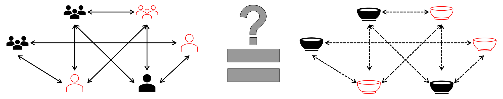
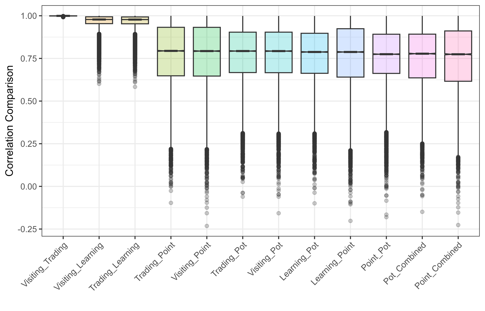
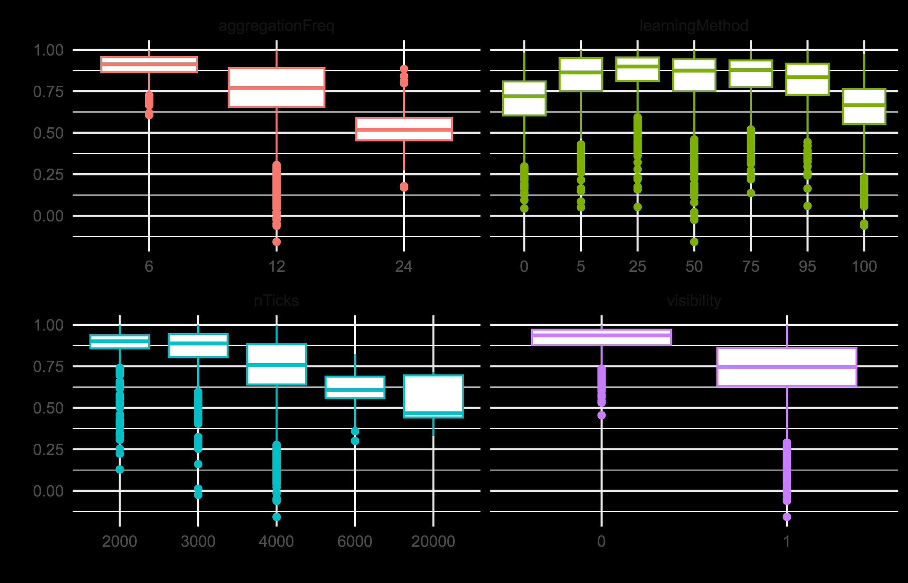
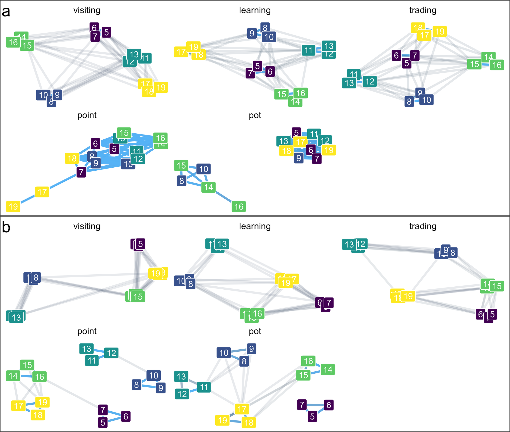

This is a research update on a new paper my colleague Cecilia Padilla-Iglesias and I recently submitted for peer review:

**Bischoff, R. J., & Padilla-Iglesias, C. (submitted)**  
*Bridging Material Culture Networks and Social Networks in Archaeology.*

You can read the full preprint on [OSF](https://osf.io/preprints/socarxiv/wjsyg_v3)

Because this manuscript is still under review, the details may still change. But the core question is simple and important:

## The question

Can similarities in artifacts (like pottery or projectile points) reliably tell us who interacted with whom in the past?

## Our research

Archaeologists often build "material culture networks" from artifact similarities and use those networks as stand-ins for social interaction. This paper tests that assumption directly using a large simulation model (ArchMatNet).

The model creates communities that visit, learn from, and trade with each other over time. At the same time, those interactions produce changing artifact patterns. That gives us two comparable networks in every run:

1. The "real" interaction network in the simulation.
2. The artifact-similarity network we would observe archaeologically.

We can then test how close those two are under different conditions.

## What looked most interesting

## Main takeaways

1. Artifact networks can be good proxies for social networks, but only when there is enough variation in traits.
2. Artifact networks are usually "fuzzier" than direct interaction networks. Strong ties can look weaker, and weak ties can look stronger.
3. Different artifact classes can produce different network patterns, even when they come from the same simulated social world.

## Why this matters

This gives archaeologists a practical caution: network methods are powerful, but interpretation depends heavily on how traits form, spread, and are observed. In other words, artifact similarity is informative, but not a one-to-one map of social life.

Feel free to reach out if you have questions or want to discuss the paper.