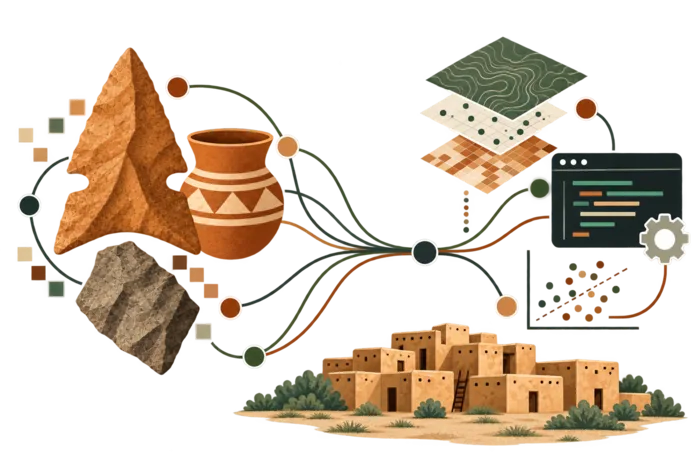
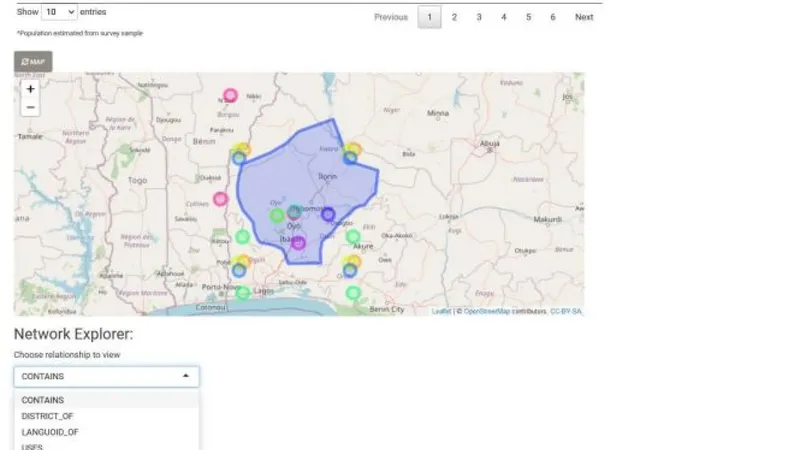
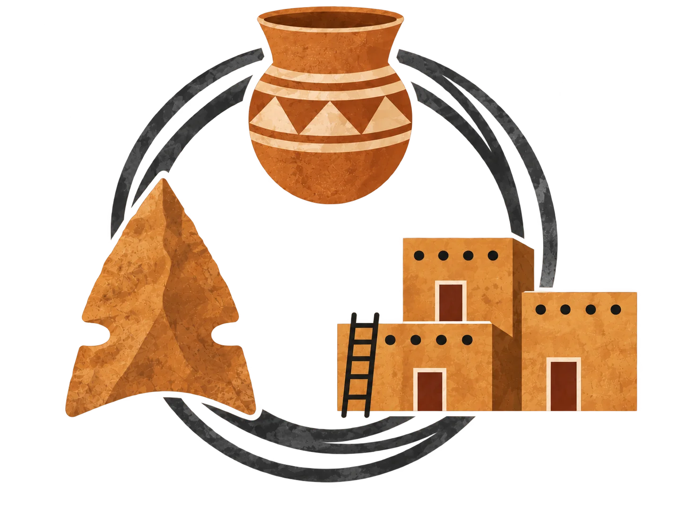
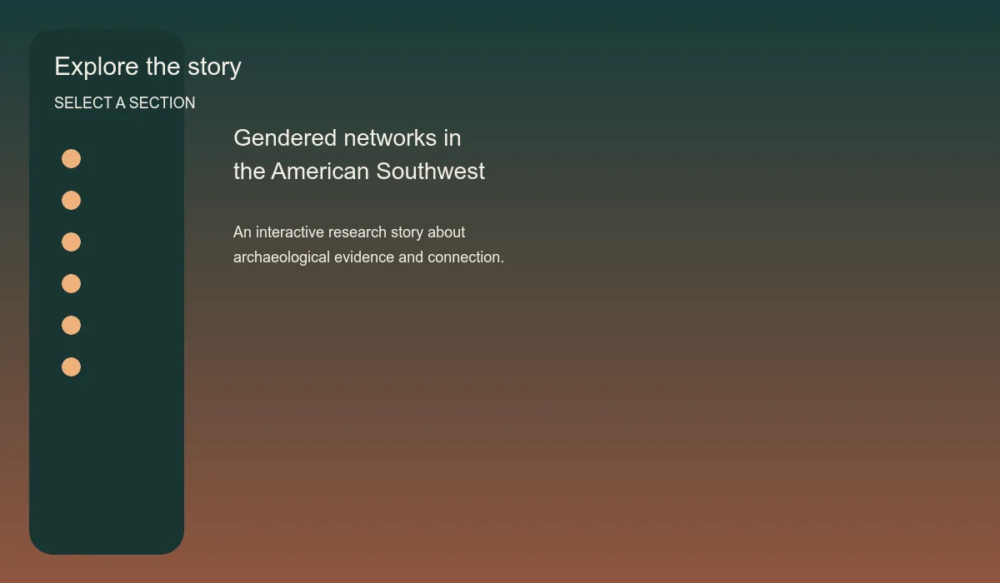
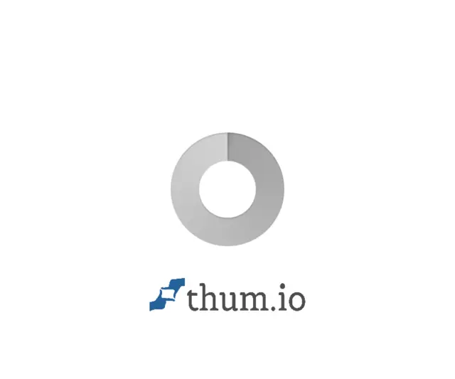

<aside class="project-index-grid" aria-label="Projects navigation">
<a href="#catmapper">01<strong>CatMapper</strong><small>Data integration</small></a>
<a href="#dissertation">02<strong>Dissertation</strong><small>Networks &amp; material culture</small></a>
<a href="#heurist">03<strong>Heurist</strong><small>Open research databases</small></a>
<a href="#archaeodash">04<strong>ArchaeoDash</strong><small>Compositional analysis</small></a>
</aside>
<main class="project-content">

/ SELECTED WORK

<h1>Tools for connecting archaeological evidence.</h1>

My project work sits between archaeology, software, and research infrastructure: building ways to connect datasets, test archaeological interpretations, and make analytical tools more accessible.

<section id="catmapper" class="project-feature">

01 / DATA INTEGRATION
<h2>CatMapper</h2>
A family of web applications for making categories comparable across complex datasets.

Different datasets often describe the same people, places, languages, religions, or artifacts with different names and codes. CatMapper helps researchers explore those categories, translate new data, build bridges between datasets, and document the decisions behind their work.

The platform includes SocioMap for sociopolitical categories and ArchaMap for archaeological artifact types. I was the primary developer for the applications, wrote the code, and managed the database while working with collaborators at Arizona State University and beyond.

<a class="btn btn-primary" href="https://catmapper.org/" target="_blank" rel="noopener">Visit CatMapper ↗</a><a class="text-link" href="https://shesc.asu.edu/research/projects/catmapper" target="_blank" rel="noopener">Read about it →</a><a class="text-link" href="https://news.asu.edu/20230825-asu-team-receives-half-million-dollar-nsf-grant-webbased-data-categorization-app" target="_blank" rel="noopener">ASU News →</a>

<figure class="project-visual"><figcaption>CatMapper search interface · Image courtesy of the CatMapper team / ASU News · <a href="images/catmapper-search.jpg" target="_blank" rel="noopener">View full size</a></figcaption></figure>
</section>

<section id="dissertation" class="project-feature project-feature-reverse">

02 / DISSERTATION RESEARCH
<h2>Material culture and social networks</h2>
Evaluating how archaeological evidence can—and cannot—stand in for past social relationships.

My dissertation examines the relationship between interaction networks and the material-culture patterns archaeologists use to model them. It asks when similarities in objects, styles, technologies, or sources provide useful evidence about interaction—and when those proxies distort the social worlds they are meant to represent.

The research combines network science with agent-based modeling, GIS, geometric morphometrics, and machine learning across case studies in the U.S. Southwest.

<a class="btn btn-primary" href="/Dissertation/">Read the dissertation ↗</a>

<figure class="project-visual dissertation-visual"><figcaption>Dissertation research · <a href="images/dissertation-logo.webp" target="_blank" rel="noopener">View full size</a></figcaption></figure>
</section>

<section id="heurist" class="project-feature heurist-feature">

03 / OPEN RESEARCH DATABASES
<h2>Heurist</h2>
A flexible, open-source database for research that needs relationships, context, and public access.

I use Heurist for my dissertation research and for the repository database at the Center for Archaeology and Society. Its linked-record approach makes it useful for connecting people, places, objects, documents, and research events without forcing every project into the same schema.

I have also begun contributing to the Heurist codebase. If you are considering Heurist for your own research, repository, or public humanities project, <a href="mailto:rbischoff@asu.edu">contact me</a>—I’d be happy to discuss possible workflows and database designs.

<a class="btn btn-primary" href="https://heurist.huma-num.fr/heurist?db=rbisc_dissertation&amp;website=7920" target="_blank" rel="noopener">Open the dissertation database ↗</a>

<a class="story-map-card" href="dissertation-story-map.html">Open Dissertation Story Map <b>↗</b></a>
</section>

<section id="archaeodash" class="project-feature project-feature-reverse archaeodash-feature">
<figure class="project-visual archaeodash-visual"><figcaption>ArchaeoDash homepage · Screenshot captured from the public application · <a href="images/archaeodash-homepage.webp" target="_blank" rel="noopener">View full size</a></figcaption></figure>

04 / ANALYTICAL DASHBOARD
<h2>ArchaeoDash</h2>
An open-source dashboard for exploring archaeological compositional data.

ArchaeoDash is a user-friendly web application for statistical analysis and visualization of geochemical compositional data from archaeological materials. It supports neutron activation analysis and X-ray fluorescence workflows, with tools for data preparation, exploratory visualization, PCA, LDA, clustering, group membership, distances, and export.

The application is hosted by the Center for Archaeology and Society at ASU and is available for public beta testing. The code is open source under the MIT license.

<a class="btn btn-primary" href="https://cas.rc.asu.edu/app/Archaeodash/" target="_blank" rel="noopener">Open ArchaeoDash ↗</a><a class="text-link" href="https://github.com/Center-for-Archaeology-and-Society/Archaeodash" target="_blank" rel="noopener">View the source code →</a>

</section>

<section class="project-sources">
/ PROJECT LINKS &amp; SOURCES

<a href="https://news.asu.edu/20230825-asu-team-receives-half-million-dollar-nsf-grant-webbased-data-categorization-app" target="_blank" rel="noopener">ASU News: CatMapper and the NSF grant</a> · <a href="https://catmapper.org/" target="_blank" rel="noopener">CatMapper</a> · <a href="/Dissertation/">Dissertation</a> · <a href="https://cas.rc.asu.edu/app/Archaeodash/" target="_blank" rel="noopener">ArchaeoDash</a> · <a href="https://github.com/Center-for-Archaeology-and-Society/Archaeodash" target="_blank" rel="noopener">ArchaeoDash on GitHub</a>
</section>
</main>

